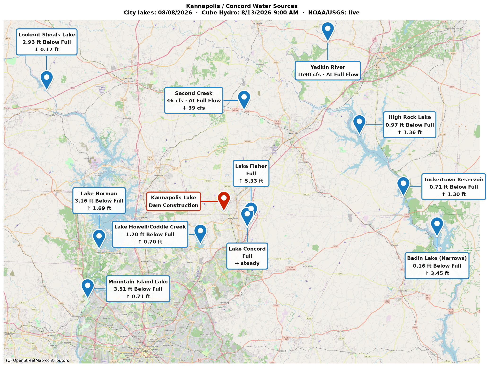

# Kannapolis / Concord Water Map

*by Brad Spry, Kannapolitan*

Generates a PNG map showing current water levels across the Kannapolis/Concord, NC area, pulling live data from four public sources:

- **City lakes** (Howell/Coddle Creek, Fisher, Concord) — scraped from [concordnc.gov](https://concordnc.gov/Departments/Water-Resources/Lake-Level-Data)
- **Kannapolis Lake** — no public sensor exists; the script prompts for a manual reading at runtime
- **USGS stream gauges** (Second Creek, Yadkin River) — live flow (cfs) and historical percentile via [waterservices.usgs.gov](https://waterservices.usgs.gov)
- **NOAA lake gauges** (Lookout Shoals, Lake Norman, Mountain Island) — pool elevation via [api.water.noaa.gov](https://api.water.noaa.gov/nwps/v1/gauges)
- **Cube Hydro Carolinas reservoirs** (High Rock, Tuckertown, Badin) — hourly pool elevation scraped from [ww4.cubecarolinas.com](https://ww4.cubecarolinas.com/lake/levels?orgID=3)

Each run stores readings in a local SQLite database (`water_data.db`) so the map can show day-over-day trend arrows.



## Usage

```bash
pip install -r requirements.txt
python3 water_map.py
```

You'll be prompted for the current Kannapolis Lake level (e.g. `93 inches below full pond`), then `water_map.png` is generated in the current directory.

Pass an alternate output path as an argument: `python3 water_map.py custom_name.png`.

## Requirements

Python 3.11+. See `requirements.txt` for dependencies.

## License

GPLv3 — see [LICENSE](LICENSE).
